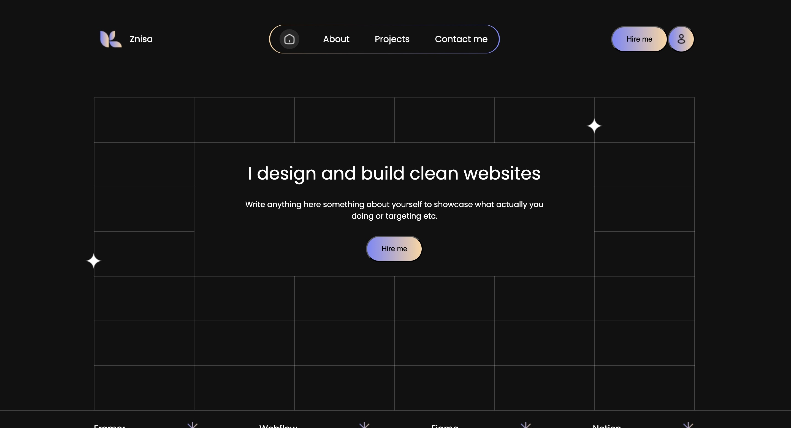
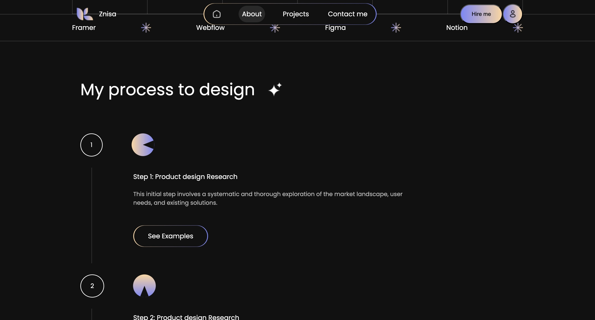

# 🌸 Znisa - Personal Portfolio Template

**Znisa** is a clean and elegant personal portfolio template perfect for developers, designers, and creatives. It features 4 main sections: **Home**, **About**, **Projects** (with Client Testimonials), and **Contact**.

---

## ✨ Features

- ⚡ **Home** – A hero section with your name, title, and call-to-action.
- 🧍‍♀️ **About** – A short introduction about yourself, skills, and background.
- 💼 **Projects** – A collection of your best work with project details and **client testimonials**.
- 📬 **Contact** – Simple contact section for visitors to reach out.

---

## Project Showcase demo



---

## 🚀 Getting Started

### 1. Clone the repository

```bash
git clone https://github.com/Leon-Paing/Znisa.git
cd Znisa
```
